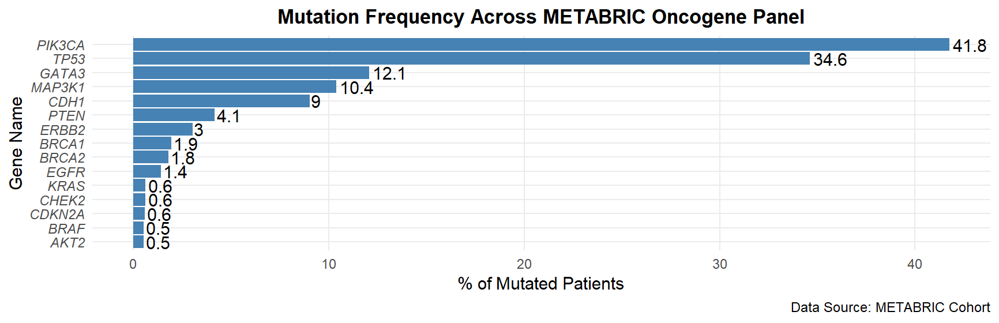
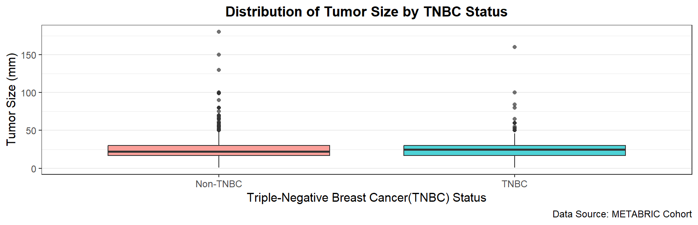
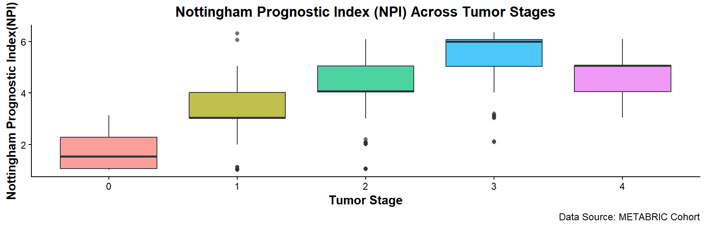
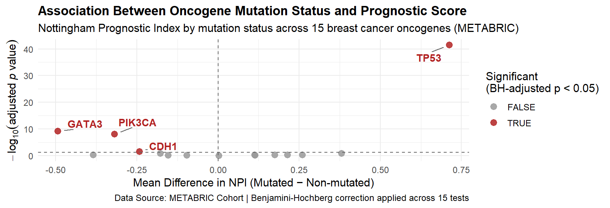

# 🧬 OncoScan: Mutation-Outcome Association Explorer in Breast Cancer (METABRIC)

## Overview

OncoScan is an exploratory data analysis project examining somatic mutation
data from the **METABRIC** breast cancer cohort (~1,900 patients). The
project applies R and the tidyverse to characterize mutation frequency
across a curated panel of 15 breast cancer oncogenes and tumor suppressors,
and statistically tests whether mutation status in these genes is
associated with the **Nottingham Prognostic Index (NPI)** — a validated
clinical prognostic score.

This is a data wrangling, visualization, and statistical inference
project — **not** a machine learning project. The goal is to demonstrate
applied R/tidyverse fluency on real, citable biomedical data, and to
practice the kind of exploratory statistical reasoning used in early-stage
cancer genomics research.

## Data Source

- **Cohort:** METABRIC (Molecular Taxonomy of Breast Cancer International
  Consortium)
- **Access:** [cBioPortal for Cancer Genomics](https://www.cbioportal.org/study/summary?id=brca_metabric)
- **Citations:**
  - Curtis, C. et al. (2012). The genomic and transcriptomic architecture
    of 2,000 breast tumours reveals novel subgroups. *Nature*, 486,
    346–352.
  - Pereira, B. et al. (2016). The somatic mutation profiles of 2,433
    breast cancers refine their genomic and transcriptomic landscapes.
    *Nature Communications*, 7, 11479.

## Tools & Technologies

- **R** — core language
- **tidyverse** — `dplyr`, `stringr`, `forcats`, `tidyr`, `ggplot2`
- **ggrepel** — non-overlapping plot labels
- **R Markdown** — reproducible reporting
- Base R statistics — Welch's t-test, `p.adjust()` (Benjamini-Hochberg
  correction)

## Skills Demonstrated

`select` `filter` `arrange` `mutate` `summarise` `group_by` `relocate` ·
`case_when` `across` `%in%` `glimpse` `count` · `pivot_longer` ·
`left_join` `bind_rows` · `str_detect` `str_remove` `str_to_upper` ·
`forcats` (`fct_reorder`, factor releveling) · `group_modify` for
per-group statistical testing · multiple-testing correction ·
`ggplot2` (bar, boxplot, faceted, and volcano-style visualizations,
custom themes and labels) · R Markdown reporting with inline dynamic
values

## Key Findings

1. **Mutation frequency validated against literature.** PIK3CA (~42%) and
   TP53 (~35%) are the most frequently mutated genes in this panel,
   consistent with published METABRIC mutation frequencies (Pereira et
   al., 2016) — confirming the data pipeline is correct end-to-end.
2. **Four genes show a statistically significant association with NPI**
   after Benjamini-Hochberg correction across 15 tests: **TP53, GATA3,
   PIK3CA, and CDH1**.
3. **Direction of effect reflects known tumor biology.** TP53 mutation is
   associated with a *higher* (worse) NPI, consistent with its role as a
   tumor suppressor linked to more aggressive disease. GATA3, PIK3CA, and
   CDH1 mutations are each associated with *lower* (better) NPI,
   consistent with their association with lower-grade luminal/lobular
   breast cancer subtypes.
4. **NPI increases with tumor stage** (Stage 0 → Stage 3), as clinically
   expected; a non-monotonic dip at Stage 4 is explained and documented
   rather than treated as an error (see Limitations).

## Project Workflow

1. Data loading and initial inspection (`glimpse`, structure checks)
2. Data cleaning — missing value handling, type correction, derived
   clinical variables (`case_when`)
3. Oncogene panel definition and verification against dataset columns
4. Reshaping wide-format mutation data to long format (`pivot_longer`)
   and classifying mutation type via string pattern matching
5. Mutation frequency analysis and visualization
6. Clinical stratification (tumor size by TNBC status; NPI by tumor
   stage)
7. Per-gene statistical testing (mutated vs. non-mutated NPI) with
   multiple-testing correction
8. Volcano-style visualization of effect size vs. statistical
   significance

## Figures

**Mutation frequency across the 15-gene oncogene panel**


**Tumor size distribution by TNBC status**


**NPI distribution across tumor stages**


**Gene mutation–NPI association (volcano plot)**


## Limitations

- `tumor_stage` is missing for ~26% of patients; stage-based analyses
  reflect only the staged subset.
- ~10% of mutated gene instances (concentrated in PIK3CA and MAP3K1)
  involve multiple co-occurring mutations in the same gene; these are
  classified by a single dominant mutation type rather than split into
  individual variant-level events.
- The association analysis uses NPI rather than time-to-event survival
  analysis, since proper survival modeling requires handling censored
  observations (patients alive at last follow-up), which is outside the
  current scope.
- Statistical significance does not necessarily imply large clinical
  effect size — this distinction is discussed explicitly in the report
  for the TP53 result.
- This analysis is exploratory and hypothesis-generating; it does not
  establish causality.

## Future Improvements

- Kaplan-Meier and Cox proportional hazards survival analysis using
  `overall_survival_months` with proper censoring
- Splitting multi-mutation cells into individual variant-level records
- Incorporating gene expression z-scores alongside mutation status
- Stratifying by PAM50 molecular subtype
- Extending to a Seurat/single-cell RNA-seq companion analysis

## How to Run

1. Clone this repository
2. Download `METABRIC_RNA_Mutation.csv` from
   [cBioPortal](https://www.cbioportal.org/study/summary?id=brca_metabric)
   or the mirrored [Kaggle dataset](https://www.kaggle.com/datasets/raghadalharbi/breast-cancer-gene-expression-profiles-metabric)
   and place it in the `data/` folder
3. Open `oncoscan_report.Rmd` in RStudio
4. Install required packages if needed:
   ```r
   install.packages(c("tidyverse", "ggrepel"))
   ```
5. Click **Knit** to reproduce the full report as HTML

## Repository Structure

```
oncoscan-metabric/
├── oncoscan_report.Rmd
├── data/
│   └── METABRIC_RNA_Mutation.csv
├── figures/
└── README.md
```

## Author

**Kennedy Kasonde**
Biology undergraduate, Livingstone College
[LinkedIn](http://www.linkedin.com/in/KennedyKasonde)
